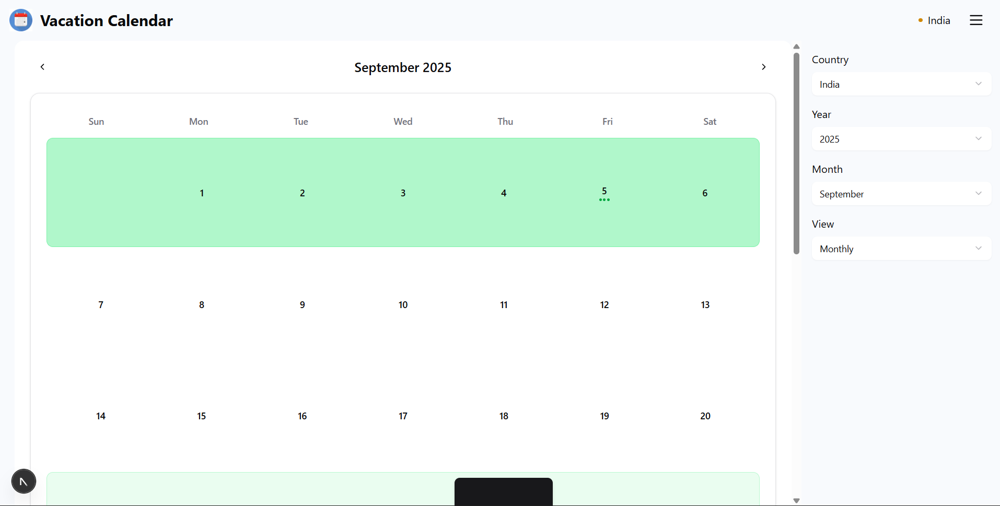
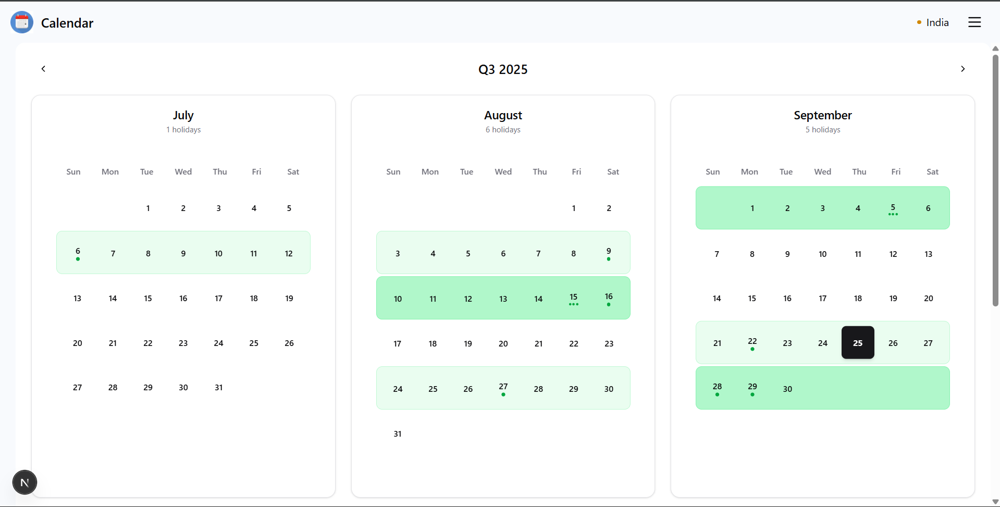
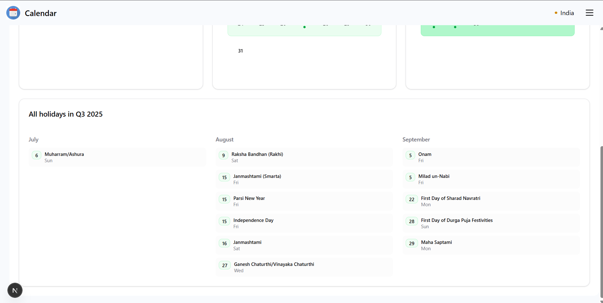
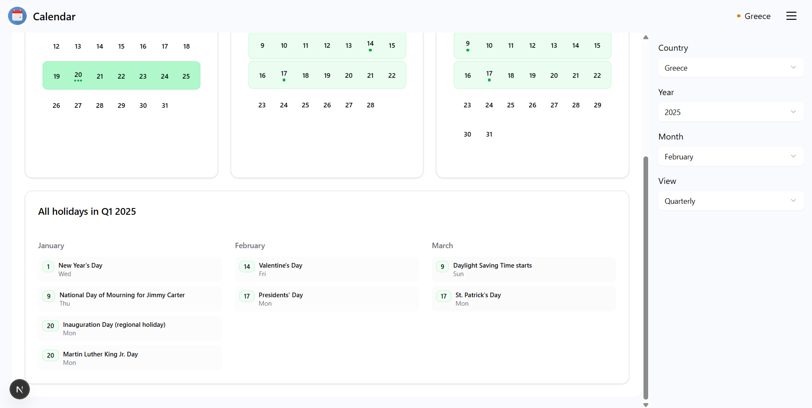
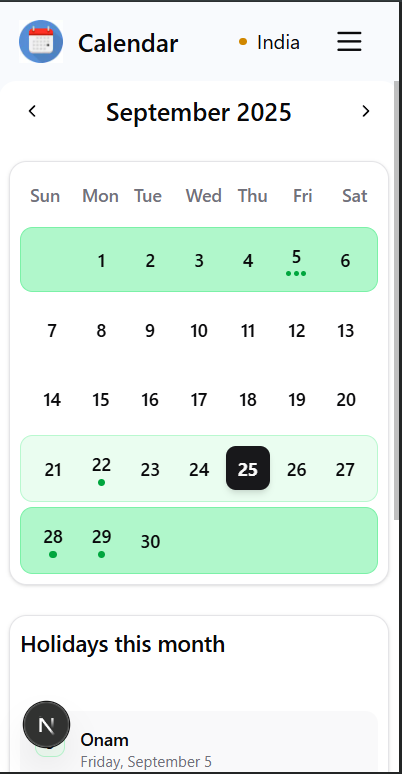

# Vacation Calendar

Vacation Calendar is a responsive web application that helps users track holidays and vacations for different countries. It provides an elegant and user-friendly interface to view and manage holiday data.

## Features
- View holidays for various countries.
- Responsive design for seamless usage across devices.
- Interactive calendar view.
- Country-specific holiday data.

## Tech Stack
- **Next.js**: Framework for server-rendered React applications.
- **Tailwind CSS**: Utility-first CSS framework for styling.
- **TypeScript**: Strongly typed programming language for JavaScript.
- **Lucide Icons**: Icon library for modern UI components.

## Getting Started

### Prerequisites
- Node.js (v16 or later)
- npm or yarn

### Installation
1. Clone the repository:
   ```bash
   git clone https://github.com/sahilbishnoi156/calendar.git
   ```
2. Navigate to the project directory:
   ```bash
   cd calendar
   ```
3. Install dependencies:
   ```bash
   npm install
   # or
   yarn install
   ```

### Running the Development Server
Start the development server:
```bash
npm run dev
# or
yarn dev
```

Open [http://localhost:3000](http://localhost:3000) in your browser to view the app.

## Usage
- Select a country to view its holidays.
- Navigate through months and years using the calendar controls.
- Use the responsive menu for additional options.

## Snapshots







## License
This project is licensed under the MIT License. See the LICENSE file for details.
